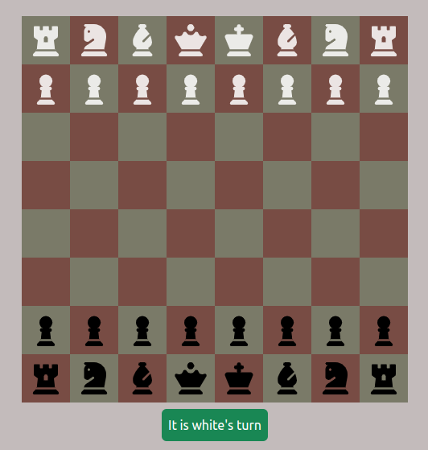
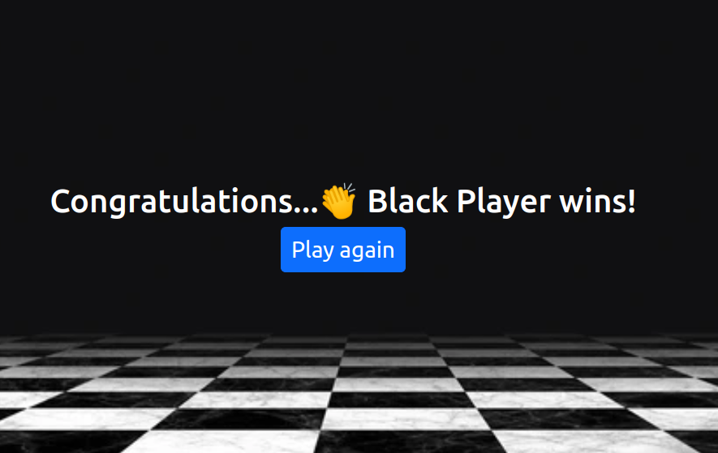

# Chess Game App
This is a simple chess game app implemented using HTML, CSS, Bootstrap and JavaScript.

The goal of this project is to create a playable chess game that players may use to compete with one against another. It contains all the conventional chess moves and rules for every piece.

## Screenshots

## Features
- Chess board with pieces
- Player turn indicator
- Drag and drop behavior
- Responsiveness

## Technologies Used
- HTML
- CSS
- Bootstrap
- JavaScript

## Installation
1. Clone the repository: https://github.com/Ruwini-Thakshila/chess-game-app.git
2. Start the game by opening index.html in your web browser.

## Contributing
If you'd like to contribute to the project, follow these steps:

1. Fork the project.
2. Create a new branch for your feature or bug fix.
3. Make your changes and submit a pull request.

## Version
0.1.0

## License
Copyright &copy; 2023. Ruwini Thakshila. All Rights Reserved!
This project is licensed under the [MIT License](License.txt).

